# Semantic Evaluation Lab

## 🌐 **NEW: User-Friendly Web Interface!**

**Experience AI evaluation like never before with our brand-new Web UI!**

### ✨ One-Click Demo
```bash
# Clone and start the complete demo environment
git clone git@github.com:vishalm/semantic-evaluation-lab.git
cd semantic-evaluation-lab
make ui-demo

# Open your browser to http://localhost:5000
```

**🎯 What You'll See:**
- **Real-time Dashboard**: Live service monitoring with color-coded health indicators
- **One-Click Test Management**: Visual cards for running all test types
- **Integrated Monitoring**: Direct access to Grafana and Prometheus dashboards
- **Load Testing Interface**: Interactive performance testing with quality metrics
- **Live Configuration**: Dynamic environment management
- **Real-time Logs**: Stream logs directly in the browser

**Perfect for:** Demos, development, research, production monitoring, and showcasing AI evaluation capabilities.

---

## Overview

A comprehensive **laboratory for evaluating, testing, and monitoring Semantic Kernel AI applications** with state-of-the-art LLM evaluation using DeepEval. Features dual AI provider support (Azure OpenAI + Ollama), advanced load testing with Locust, and end-to-end observability.

[](https://python.org)
[](https://github.com/microsoft/semantic-kernel)
[](https://github.com/confident-ai/deepeval)
[](https://locust.io)
[](LICENSE)

## 🧪 **Purpose of Semantic Evaluation Lab**

**Semantic Evaluation Lab** serves as a comprehensive research and development environment for advancing AI evaluation methodologies. It addresses critical challenges in enterprise AI deployment:

### **🎯 Primary Objectives**

1. **🔬 Research Platform**: Advance the state-of-the-art in LLM evaluation methodologies
2. **🏭 Enterprise Template**: Provide production-ready patterns for AI quality assurance
3. **📚 Educational Resource**: Demonstrate best practices for AI application testing
4. **🌊 Innovation Catalyst**: Enable rapid experimentation with evaluation techniques
5. **🔄 Continuous Improvement**: Establish feedback loops for AI system enhancement

### **🚀 Key Use Cases**

- **AI Quality Research**: Study conversation chain stability and evaluation framework robustness
- **Enterprise AI Deployment**: Template for production AI systems with quality gates
- **Educational Training**: Hands-on learning for AI evaluation techniques
- **Vendor Evaluation**: Compare AI providers and models under standardized conditions
- **Compliance & Governance**: Establish audit trails for AI system quality
- **Performance Optimization**: Identify bottlenecks and optimization opportunities

### **🌟 Unique Value Proposition**

Unlike traditional testing frameworks, **Semantic Evaluation Lab** provides:
- **🔗 End-to-End Integration**: From development to production monitoring
- **📊 Multi-Dimensional Evaluation**: Quality, performance, and stability metrics
- **🔄 Dynamic Testing**: Real-world conversation patterns and adaptive scenarios
- **📈 Continuous Monitoring**: Real-time quality assessment under load
- **🧩 Modular Architecture**: Extensible for custom evaluation needs

## 🏗️ **System Architecture**


## 📊 **Comprehensive Observability Strategy**

**Semantic Evaluation Lab** implements **360-degree observability** - monitoring every aspect of the AI evaluation pipeline from development to production.

### **🔍 Observability Layers**

#### **1. 🤖 AI Application Layer**
**What We Observe:**
- **Agent Response Quality**: Real-time DeepEval metric scores
- **Conversation Flow**: Turn-by-turn conversation analysis
- **Model Performance**: Token usage, response times, error rates
- **Context Management**: Memory usage, context window utilization

**How We Observe:**
```python
# Automatic metric collection during evaluation
@observe(metrics=[AnswerRelevancyMetric(threshold=0.7)])
def llm_component(user_input: str):
    response = agent.invoke(user_input)
    # Metrics automatically collected and sent to Prometheus
    return response
```

#### **2. 🧪 Evaluation Framework Layer**
**What We Observe:**
- **Framework Stability**: Coefficient of variation across conversation chains
- **Metric Consistency**: Score variation and trend analysis
- **Evaluation Performance**: Time per evaluation, throughput rates
- **Quality Thresholds**: Pass/fail rates against defined thresholds

**Key Metrics:**
```
deepeval_metric_scores{metric_name, test_type, chain_length}
deepeval_framework_stability_coefficient{metric_name, chain_length}
deepeval_evaluation_duration_seconds{metric_name, test_type}
```

#### **3. 🔥 Load Testing Layer**
**What We Observe:**
- **Performance Under Load**: Response times during load tests
- **Quality Degradation**: DeepEval scores under increasing load
- **User Simulation**: Virtual user behavior and patterns
- **System Stress Points**: Breaking points and recovery patterns

**Real-time Dashboard:**
- Load test progress and current metrics
- Quality vs. performance trade-offs
- User simulation effectiveness
- System resource utilization

#### **4. 🧪 Testing Laboratory Layer**
**What We Observe:**
- **Test Execution**: Success/failure rates across test types
- **Coverage Metrics**: Code coverage and test completeness
- **Test Performance**: Execution duration and parallelization efficiency
- **Flaky Test Detection**: Test stability and reliability patterns

**Automated Tracking:**
```
test_executions_total{test_type, status, chain_length}
test_duration_seconds{test_type, chain_length}
test_coverage_percentage{module, test_type}
```

#### **5. 🐳 Infrastructure Layer**
**What We Observe:**
- **Container Health**: CPU, memory, disk usage per service
- **Network Performance**: Inter-service communication latency
- **Volume Usage**: Storage utilization and growth patterns
- **Service Dependencies**: Health checks and dependency graphs

**System Metrics:**
```
container_cpu_usage_percent{service}
container_memory_usage_bytes{service, type}
ollama_service_up{} 
ollama_models_loaded{}
```

#### **6. 🔄 Business Logic Layer**
**What We Observe:**
- **Conversation Quality Trends**: Long-term quality improvement/degradation
- **Model Comparison**: Performance across different AI providers
- **Feature Usage**: Which evaluation features are most utilized
- **ROI Metrics**: Cost vs. quality improvements

### **📈 Real-time Monitoring Capabilities**

#### **Live Dashboards**

```mermaid
graph LR
    subgraph "📊 Grafana Real-time Dashboards"
        Overview[🏠 System Overview]
        Quality[📊 Quality Metrics]
        Performance[⚡ Performance]
        Load[🔥 Load Testing]
        Infrastructure[🐳 Infrastructure]
        Business[💼 Business Metrics]
    end
    
    subgraph "🔔 Alert Channels"
        Slack[Slack Notifications]
        Email[Email Alerts]
        Webhook[Webhook Integration]
        PagerDuty[PagerDuty Escalation]
    end
    
    Overview --> Quality
    Quality --> Performance
    Performance --> Load
    Load --> Infrastructure
    Infrastructure --> Business
    
    Quality --> Slack
    Performance --> Email
    Load --> Webhook
    Infrastructure --> PagerDuty
```


#### **Alert Conditions**
- **Quality Degradation**: DeepEval scores below threshold
- **Performance Issues**: Response times exceeding SLA
- **System Health**: Container or service failures
- **Load Test Failures**: Quality under load below acceptable levels
- **Resource Exhaustion**: Memory/CPU/disk usage alerts

### **🔧 Observability Implementation**

#### **Metrics Collection Pipeline**
```python
# Structured logging with automatic metrics
from logging_config import get_logger, update_metrics

logger = get_logger(__name__)

@update_metrics("conversation_evaluation")
def evaluate_conversation(chain_length: int):
    start_time = time.time()
    
    try:
        # Evaluation logic
        result = deepeval.evaluate(test_case)
        
        # Automatic metric collection
        logger.info("evaluation_completed", extra={
            "chain_length": chain_length,
            "score": result.score,
            "duration": time.time() - start_time,
            "status": "success"
        })
        
        return result
    except Exception as e:
        logger.error("evaluation_failed", extra={
            "error": str(e),
            "chain_length": chain_length
        })
        raise
```

#### **Custom Metric Integration**
```python
# Custom business metrics
from prometheus_client import Counter, Histogram, Gauge

conversation_quality_trend = Gauge(
    'conversation_quality_trend',
    'Trending quality score over time',
    ['model_type', 'conversation_type']
)

evaluation_cost = Counter(
    'evaluation_cost_total',
    'Total cost of evaluations',
    ['provider', 'model']
)
```

### **📋 Observability Features**

| Feature | Implementation | Benefits |
|---------|----------------|----------|
| **Real-time Metrics** | Prometheus + Grafana | Instant visibility into system health |
| **Structured Logging** | JSON logs + correlation IDs | Easy debugging and analysis |
| **Distributed Tracing** | DeepEval component tracing | End-to-end request visibility |
| **Custom Dashboards** | Grafana provisioning | Role-specific monitoring views |
| **Automated Alerting** | Prometheus AlertManager | Proactive issue detection |
| **Historical Analysis** | Time-series data retention | Trend analysis and capacity planning |
| **Business Intelligence** | Custom metrics + reports | ROI and impact measurement |

### **🎯 Observability Outcomes**

- **🔍 Complete Visibility**: Every component and interaction monitored
- **⚡ Rapid Detection**: Issues identified in real-time
- **📊 Data-Driven Decisions**: Metrics guide optimization efforts  
- **🔄 Continuous Improvement**: Historical trends inform enhancements
- **💰 Cost Optimization**: Resource usage and efficiency tracking
- **🛡️ Quality Assurance**: Automated quality gates and thresholds
- **📈 Performance Optimization**: Bottleneck identification and resolution

## 🧪 **What is Semantic Evaluation Lab?**

**Semantic Evaluation Lab** is a comprehensive laboratory environment where AI applications are **evaluated, tested, and perfected**. It provides:

- **🧪 LLM Evaluation Laboratory**: Research-grade evaluation with DeepEval metrics
- **🔬 Conversation Analysis**: Static and dynamic conversation chain testing  
- **🔥 Load Testing Lab**: Professional load testing with quality assessment
- **📊 Observability Platform**: Real-time monitoring with Prometheus/Grafana
- **🐳 Production Environment**: Docker-based deployment with CI/CD pipelines

## Key Features

### **LLM Evaluation with DeepEval** (NEW!)
- **Research-backed metrics**: G-Eval, Answer Relevancy, Faithfulness, Hallucination Detection
- **Component-level evaluation**: Trace and evaluate individual LLM components 
- **Dataset evaluation**: Batch testing with Golden datasets
- **Real-time monitoring**: Integration with Confident AI platform
- **Advanced metrics**: Bias detection, toxicity filtering, contextual precision/recall
- **Async evaluation**: Support for streaming and async agent responses

### Production-Ready Architecture
- **Configuration Management**: Environment-based configuration with validation
- **Dual AI Support**: Azure OpenAI and local Ollama integration
- **Async Operations**: Full async/await support for optimal performance
- **Error Handling**: Comprehensive validation and helpful error messages
- **CI/CD Pipeline**: Enterprise-grade testing and quality gates
- **Test Reports**: Automated test report generation and archiving

## Project Architecture


## LLM Evaluation Framework

This project showcases enterprise-grade LLM evaluation using [DeepEval](https://github.com/confident-ai/deepeval) - the leading LLM evaluation framework with 7.1k+ GitHub stars.

### 🔬 Conversation Chain Stability Testing (NEW!)

**Revolutionary approach to testing LLM evaluation framework stability** through multi-turn technical conversations.

#### **Two Testing Approaches**

**1. Static Conversation Testing** (`test_conversation_chains.py`)
- **Pre-orchestrated scenarios**: Complex technical mathematical content
- **Repeatable patterns**: Linear Algebra, Calculus, Probability Theory
- **Predictable flow**: Fixed conversation paths with complexity scaling
- **Framework baseline**: Establishes evaluation stability baselines

**2. Dynamic Conversation Testing** (`test_dynamic_conversation_chains.py`) ⭐ **NEW!**
- **Question-from-response generation**: Each question emerges from previous AI response
- **Natural evolution**: Topics flow organically based on content
- **Realistic patterns**: Mimics how humans actually conduct conversations
- **Real-world testing**: Framework robustness under natural conditions

#### **Key Features**
- **Multi-turn conversations**: Test chains of 5, 10, 15, and 20 exchanges
- **Technical mathematical content**: Complex scenarios including Linear Algebra, Calculus, and Probability Theory
- **Framework stability analysis**: Measure DeepEval consistency across conversation lengths
- **Comprehensive logging**: Structured logging with Prometheus metrics integration
- **Performance monitoring**: Real-time metrics collection and analysis
- **Automated reporting**: Generate stability reports with evidence tables

#### **Test Scenarios**
| Scenario | Description | Sample Topics |
|----------|-------------|---------------|
| **Linear Algebra** | Matrix operations, eigenvalues, vector spaces | Matrix rank, spectral decomposition, computational complexity |
| **Calculus & Optimization** | Differential calculus, constrained optimization | Lagrange multipliers, gradient descent, Newton-Raphson |
| **Probability Theory** | Statistical inference, Bayesian methods | Central Limit Theorem, Bayes' theorem, hypothesis testing |

#### **Stability Metrics**
- **Coefficient of Variation (CV)**: Measures score consistency across turns
- **Score Range Analysis**: Tracks metric variation throughout conversation
- **Trend Analysis**: Linear regression on score progression
- **Cross-chain Consistency**: Compares stability across different chain lengths

#### **Running Conversation Chain Tests**

**Static (Orchestrated) Conversation Tests:**
```bash
# Run all conversation chain tests
make test-conversation-chains

# Test specific chain lengths
make test-chain-5    # 5-turn chains
make test-chain-10   # 10-turn chains  
make test-chain-15   # 15-turn chains
make test-chain-20   # 20-turn chains

# Run with comprehensive metrics collection
make test-conversation-chains-with-metrics

# Run with Ollama (local evaluation)
make test-conversation-chains-ollama
```

**Dynamic (Question-from-Response) Conversation Tests:** ⭐ **NEW!**
```bash
# Run all dynamic conversation tests
make test-dynamic-conversations

# Test specific dynamic conversation lengths (separate tests)
make test-dynamic-5    # 5-turn dynamic conversations
make test-dynamic-10   # 10-turn dynamic conversations  
make test-dynamic-15   # 15-turn dynamic conversations
make test-dynamic-20   # 20-turn dynamic conversations

# Run with Ollama (local evaluation)
make test-dynamic-conversations-ollama

# Compare static vs dynamic approaches
make test-conversation-comparison
```

**Generate Reports and Metrics:**
```bash
# Generate stability reports
make generate-stability-report

# Export Prometheus metrics
make export-metrics

# View current metrics
make view-metrics

# Clean logs and reports
make clean-logs
```

#### **Logging & Monitoring System**

**Structured Logging Features:**
- **JSON format**: Machine-readable logs for easy ingestion
- **Prometheus integration**: Real-time metrics collection
- **Performance tracking**: Duration and throughput metrics
- **Error monitoring**: Comprehensive error categorization
- **Test context**: Automatic test environment detection

**Key Metrics Collected:**
```
# Test execution metrics
deepeval_tests_total{test_type, chain_length, status}
deepeval_test_duration_seconds{test_type, chain_length}

# Metric evaluation metrics  
deepeval_metric_evaluation_seconds{metric_name, test_type}
deepeval_metric_scores{metric_name, test_type, chain_length}

# Framework stability metrics
deepeval_framework_stability_coefficient{metric_name, chain_length}
deepeval_conversation_turns_total{chain_length}

# Error tracking
deepeval_errors_total{error_type, component}
```

**Sample Log Output:**
```json
{
  "timestamp": "2024-01-15T10:30:45.123Z",
  "level": "INFO", 
  "logger": "conversation_chain",
  "service": "deepeval-testing",
  "event": "conversation_chain_completed",
  "chain_length": 10,
  "average_scores": {
    "AnswerRelevancyMetric": 0.8234,
    "Mathematical_Accuracy": 0.7891,
    "Technical_Depth": 0.8456
  },
  "stability_summary": {
    "AnswerRelevancyMetric": 0.156,
    "Mathematical_Accuracy": 0.203,
    "Technical_Depth": 0.178
  }
}
```

### Evaluation Metrics Available

| Metric | Description | Use Case |
|--------|-------------|----------|
| **G-Eval** | Research-backed evaluation using LLM-as-a-judge | Custom criteria evaluation |
| **Answer Relevancy** | Measures how relevant responses are to questions | RAG applications |
| **Faithfulness** | Ensures responses are faithful to retrieved context | Factual accuracy |
| **Hallucination Detection** | Detects when models generate false information | Safety & reliability |
| **Bias Detection** | Identifies potential bias in responses | Fairness & ethics |
| **Toxicity Detection** | Filters harmful or inappropriate content | Content safety |
| **Contextual Precision** | Measures precision of retrieved context | RAG optimization |
| **Contextual Recall** | Measures recall of retrieved context | Information completeness |

### Evaluation Test Structure

```
tests/llm_evaluation/
├── test_agent_responses.py        # Core LLM evaluation tests
├── test_deepeval_integration.py   # Advanced DeepEval features
├── test_conversation_chains.py    # Conversation chain stability tests (NEW!)
└── __init__.py                    # Package initialization

# Supporting infrastructure
├── logging_config.py              # Structured logging & Prometheus metrics (NEW!)
├── logs/                          # Generated log files (NEW!)
└── test-reports/                  # Generated reports & metrics (NEW!)
```

### Running LLM Evaluations

```bash
# Run all LLM evaluation tests
make test-llm-eval

# Run specific evaluation categories
make eval-agent-quality      # Test response quality metrics
make eval-agent-workflow     # Test complete agent workflows  
make eval-dataset           # Test dataset-based evaluation
make eval-integration       # Test DeepEval integration features

# Run conversation chain stability tests (NEW!)
make test-conversation-chains

# Run with DeepEval CLI (requires OPENAI_API_KEY)
make test-deepeval

# Generate comprehensive test reports
make test-reports

# Clean logs and reports
make clean-logs
```

### Evaluation Workflow


### **Sample Stability Report Output**

```markdown
# DeepEval Conversation Chain Stability Report

## Test Summary
| Metric | Value |
|--------|-------|
| Total Chains Evaluated | 4 |
| Total Conversation Turns | 50 |
| Average Time per Turn | 2.3 seconds |
| Framework Stability | High |

## Performance by Chain Length
| Chain Length | Avg Relevancy | Avg Faithfulness | Stability (CV) | Status |
|--------------|---------------|------------------|----------------|--------|
| 5 | 0.820 | 0.780 | 0.150 | ✅ Stable |
| 10 | 0.840 | 0.810 | 0.180 | ✅ Stable |
| 15 | 0.830 | 0.790 | 0.220 | ✅ Stable |
| 20 | 0.850 | 0.820 | 0.190 | ✅ Stable |

## Stability Analysis
- **Coefficient of Variation (CV) < 0.25**: Excellent stability
- **CV 0.25-0.50**: Good stability  
- **CV > 0.50**: Needs improvement
```

## Prerequisites

- Python 3.8 or higher
- Git for cloning the repository
- **For LLM Evaluation**: OpenAI API key (required for DeepEval metrics)
- For Azure OpenAI: Valid Azure OpenAI API key and endpoint  
- For Ollama: Local Ollama installation with desired models

## Installation & Setup

### 1. Clone the Repository
```bash
git clone git@github.com:vishalm/semantic-evaluation-lab.git
cd semantic-evaluation-lab
```

### 2. Create Virtual Environment
```bash
python -m venv venv

# On macOS/Linux
source venv/bin/activate

# On Windows
venv\Scripts\activate
```

### 3. Install Dependencies
```bash
pip install -r requirements.txt
```

### 4. Configure Environment
```bash
# Copy the example environment file
cp env.example .env

# Edit .env with your actual values
nano .env  # or use your preferred editor
```

## Configuration

The project uses environment variables for configuration. Here's the configuration flow:


### Quick Start (Ollama - Default)
The project defaults to using Ollama for easy local development:

1. **Install Ollama** (if not already installed):
   ```bash
   # macOS
   brew install ollama
   
   # Or download from https://ollama.ai
   ```

2. **Start Ollama service**:
   ```bash
   ollama serve
   ```

3. **Pull a model** (in another terminal):
   ```bash
   ollama pull qwen2.5:latest
   ```

4. **Run the project**:
   ```bash
   python basic_agent.py
   ```

### Azure OpenAI Setup
To use Azure OpenAI instead of Ollama:

1. **Update .env file**:
   ```env
   USE_OLLAMA=false
   AZURE_OPENAI_API_KEY=your-api-key-here
   AZURE_OPENAI_ENDPOINT=https://your-resource.openai.azure.com/
   ```

2. **Run the project**:
   ```bash
   python basic_agent.py
   ```

### Required Environment Variables

| Variable | Description | Required For |
|----------|-------------|--------------|
| `USE_OLLAMA` | Use Ollama (true) or Azure OpenAI (false) | All |
| `AZURE_OPENAI_API_KEY` | Your Azure OpenAI API key | Azure OpenAI only |
| `AZURE_OPENAI_ENDPOINT` | Your Azure OpenAI endpoint | Azure OpenAI only |
| `AZURE_OPENAI_DEPLOYMENT_NAME` | Deployment name (default: gpt-35-turbo) | Azure OpenAI only |
| `OLLAMA_HOST` | Ollama server URL (default: http://localhost:11434) | Ollama only |
| `OLLAMA_MODEL_ID` | Ollama model ID (default: qwen2.5:latest) | Ollama only |
| `OPENAI_API_KEY` | OpenAI API key for DeepEval metrics | **LLM Evaluation** |

### Optional Configuration Variables

| Variable | Description | Default |
|----------|-------------|---------|
| `AGENT_NAME` | Name for the AI agent | SK-Assistant |
| `AGENT_INSTRUCTIONS` | System instructions for the agent | You are a helpful assistant. |
| `AZURE_OPENAI_API_VERSION` | Azure OpenAI API version | 2024-02-01 |

## Running the Project

### Option 1: Universal Agent (Recommended)
```bash
python basic_agent.py
```
This script automatically detects your configuration and uses either Ollama or Azure OpenAI.

### Option 2: Ollama-Specific Implementation
```bash
python basic_agent_ollama.py
```
This script demonstrates Semantic Kernel's function/plugin approach with Ollama.

### Expected Output

**With Ollama:**
```
Using Ollama - Azure OpenAI configuration not required.

Using Ollama model: qwen2.5:latest
Starting SK-Assistant...

Response:
Code flows like thought,
Semantic bridges connect minds—
AI learns, we grow.
```

**With Azure OpenAI:**
```
Using Azure OpenAI deployment: gpt-35-turbo
Starting SK-Assistant...

Response:
Language's essence,
Semantic threads intertwine,
Meaning's core revealed.
```

## LLM Evaluation Examples

### Basic Response Quality Test
```python
from deepeval import assert_test
from deepeval.test_case import LLMTestCase
from deepeval.metrics import AnswerRelevancyMetric

test_case = LLMTestCase(
    input="What is Semantic Kernel?",
    actual_output="Semantic Kernel is an open-source SDK for AI orchestration.",
    retrieval_context=["Semantic Kernel is an SDK for integrating AI services"]
)

answer_relevancy = AnswerRelevancyMetric(threshold=0.7)
assert_test(test_case, [answer_relevancy])
```

### Advanced G-Eval Custom Metric
```python
from deepeval.metrics import GEval

helpfulness_metric = GEval(
    name="Helpfulness",
    criteria="""
    Evaluate whether the response is helpful based on:
    1. Directly addresses the user's question
    2. Provides accurate information
    3. Offers actionable guidance
    4. Uses clear, understandable language
    """,
    evaluation_params=["input", "actual_output"],
    threshold=0.8
)
```

### Component-Level Evaluation
```python
from deepeval.tracing import observe, update_current_span

@observe(metrics=[AnswerRelevancyMetric(threshold=0.7)])
def llm_component(user_input: str):
    response = your_llm_call(user_input)
    
    test_case = LLMTestCase(
        input=user_input,
        actual_output=response,
        retrieval_context=["relevant context"]
    )
    update_current_span(test_case=test_case)
    
    return response
```

## Project Structure

```
semantic-evaluation-lab/
├── README.md                      # This file
├── requirements.txt               # Python dependencies (includes DeepEval)
├── pytest.ini                    # Test configuration with LLM eval markers
├── .gitignore                    # Git ignore rules
├── env.example                   # Environment variables template
├── config.py                     # Configuration management
├── basic_agent.py                # Universal agent (Ollama/Azure OpenAI)
├── basic_agent_ollama.py         # Ollama-specific implementation
├── tests/                        # Test suites
│   ├── unit/                     # Unit tests
│   ├── functional/               # Functional tests
│   └── llm_evaluation/           # DeepEval LLM evaluation tests
│       ├── test_agent_responses.py  #   Core LLM evaluation tests
│       ├── test_deepeval_integration.py #   Advanced DeepEval features
│       └── __init__.py              #   Package initialization
├── .github/workflows/            # CI/CD Pipeline
│   └── ci.yml                       #   Enhanced with LLM evaluation
├── .cursor/                      # Cursor IDE configuration
│   ├── rules                        #   Coding standards
│   ├── instructions                #   AI assistant guidelines
│   ├── composer.md                 #   Cursor Composer rules
│   ├── settings.json               #   IDE settings
│   └── README.md                   #   Configuration documentation
└── Makefile                     # Development commands (includes LLM eval)
```

## Application Flow


## CI/CD Pipeline with LLM Evaluation

The project includes an enhanced CI/CD pipeline with comprehensive LLM evaluation:

### Pipeline Stages
1. **Lint & Format** - Code quality checks
2. **Unit Tests** - Traditional unit testing
3. **Functional Tests** - Agent functionality testing
4. **LLM Evaluation Tests** - DeepEval metrics and quality assessment
5. **Integration Tests** - End-to-end testing
6. **SonarCloud Analysis** - Code quality and security
7. **Quality Gate** - All tests must pass
8. **Test Reports Archive** - Comprehensive test report storage

### Test Report Archiving
```yaml
# Example CI pipeline output
test-reports-archive:
  name: Archive All Test Reports
  runs-on: ubuntu-latest
  needs: [unit-tests, functional-tests, llm-evaluation-tests]
  
  steps:
  - name: Archive comprehensive test reports
    uses: actions/upload-artifact@v3
    with:
      name: comprehensive-test-reports
      path: test-reports/
      retention-days: 30
```

Reports include:
- **Unit test results** (XML/HTML)
- **Functional test results** (XML/HTML)  
- **LLM evaluation metrics** (DeepEval reports)
- **Coverage reports** (XML/HTML)
- **Security analysis** (Bandit JSON)

## Error Handling

The project includes comprehensive error handling:

- **Environment Validation**: Checks for required environment variables
- **Service Initialization**: Validates AI service connectivity
- **LLM Evaluation**: Validates OpenAI API key for DeepEval metrics
- **Graceful Failures**: Provides helpful error messages with solutions

Example error output:
```
Missing required environment variables for Azure OpenAI:
   - AZURE_OPENAI_API_KEY
   - AZURE_OPENAI_ENDPOINT

Set USE_OLLAMA=true to use Ollama instead, or provide Azure OpenAI credentials.

For LLM evaluation with DeepEval, set OPENAI_API_KEY in your .env file.
```

## Testing Your Setup

### Test Basic Configuration
```bash
# Check configuration loading
make config-check

# Check DeepEval integration
make deepeval-check
```

### Test Ollama Configuration
```bash
# Check if Ollama is running
curl http://localhost:11434/api/tags

# Test with the project
USE_OLLAMA=true python basic_agent.py

# Run LLM evaluation
USE_OLLAMA=true make test-llm-eval
```

### Test Azure OpenAI Configuration  
```bash
# Test with the project
USE_OLLAMA=false python basic_agent.py

# Run LLM evaluation (requires OPENAI_API_KEY)
USE_OLLAMA=false OPENAI_API_KEY=your-key make test-llm-eval
```

### Test DeepEval Integration
```bash
# Login to Confident AI (optional)
make deepeval-login

# Run comprehensive LLM evaluation
make test-deepeval

# Generate detailed test reports
make test-reports
```

## Troubleshooting

### Common Issues

#### Ollama Not Found
```bash
# Install Ollama
brew install ollama  # macOS
# or visit https://ollama.ai for other platforms

# Start the service
ollama serve
```

#### Model Not Available
```bash
# Pull the required model
ollama pull qwen2.5:latest
```

#### Azure OpenAI Authentication Error
```bash
# Check your .env file
cat .env | grep AZURE_OPENAI
```

#### DeepEval API Key Missing
```bash
# Set OpenAI API key for DeepEval metrics
echo "OPENAI_API_KEY=your-openai-api-key" >> .env
```

#### Python Virtual Environment Issues
```bash
# Recreate virtual environment
rm -rf venv
python -m venv venv
source venv/bin/activate  # or venv\Scripts\activate on Windows
pip install -r requirements.txt
```

## Development Workflow

### 1. Setup Development Environment
```bash
make dev-setup
make install-dev
```

### 2. Run Tests During Development
```bash
# Quick tests
make test-unit
make test-functional

# LLM evaluation tests
make test-llm-eval
make eval-agent-quality
```

### 3. Quality Checks
```bash
make quality-check    # Run all quality checks
make format          # Format code
make security        # Security analysis
```

### 4. Generate Reports
```bash
make test-reports    # Comprehensive test reports
make test-coverage   # Coverage analysis
```

## Contributing

1. Fork the repository
2. Create a feature branch (`git checkout -b feature/amazing-feature`)
3. Run quality checks (`make quality-check`)
4. Run LLM evaluation tests (`make test-llm-eval`)
5. Commit your changes (`git commit -m 'Add amazing feature'`)
6. Push to the branch (`git push origin feature/amazing-feature`)
7. Open a Pull Request

### Contribution Guidelines
- All tests must pass (including LLM evaluation)
- Code must meet quality standards (Black, flake8, mypy)
- Security scans must pass (Bandit)
- Add appropriate test coverage for new features
- Include LLM evaluation tests for new agent functionality

## Learning Resources

### Core Technologies
- [Microsoft Semantic Kernel Documentation](https://learn.microsoft.com/en-us/semantic-kernel/)
- [Azure OpenAI Service](https://azure.microsoft.com/en-us/products/cognitive-services/openai-service/)
- [Ollama Documentation](https://ollama.ai/docs)

### LLM Evaluation & DeepEval
- [DeepEval Documentation](https://docs.confident-ai.com)
- [DeepEval GitHub Repository](https://github.com/confident-ai/deepeval)
- [Confident AI Platform](https://confident-ai.com)
- [G-Eval Research Paper](https://arxiv.org/abs/2303.16634)
- [LLM Evaluation Best Practices](https://docs.confident-ai.com/docs/evaluation-introduction)

### Testing & Quality
- [Pytest Documentation](https://docs.pytest.org/)
- [GitHub Actions CI/CD](https://docs.github.com/en/actions)
- [SonarCloud Integration](https://sonarcloud.io/)

## License

This project is licensed under the MIT License - see the [LICENSE](LICENSE) file for details.

## Acknowledgments

- **Microsoft Semantic Kernel** team for the excellent AI orchestration framework
- **DeepEval & Confident AI** team for the leading LLM evaluation framework  
- **OpenAI** for the underlying AI models and evaluation APIs
- **Ollama** team for local AI model deployment
- **Locust** team for the excellent load testing framework
- Open source community for testing and quality tools

---

## What's Next?

**Semantic Evaluation Lab** demonstrates enterprise-ready AI application evaluation with:
- **Dual AI Provider Support** (Azure OpenAI + Ollama)
- **Enterprise-Grade Testing** (Unit, Functional, Integration, Load Testing)
- **LLM Evaluation Framework** (DeepEval with 8+ metrics)
- **CI/CD Pipeline** (Quality gates, automated testing)
- **End-to-End Observability** (Prometheus + Grafana monitoring)
- **Professional Development** (Type hints, code quality, documentation)

**Ready to evaluate and perfect your AI applications with confidence!**

## 🐳 **Docker Setup** (NEW!)

The project now includes a comprehensive Docker setup for consistent development, testing, and production environments.

### **Quick Start with Docker**

```bash
# Check Docker environment
make docker-env-check

# Start complete development environment
make docker-dev

# Run all tests in Docker
make docker-test-all

# Run CI pipeline locally
make docker-ci
```

### **Docker Benefits**

✅ **Consistent Environments**: Identical setup across development, testing, and production  
✅ **Isolated Dependencies**: No conflicts with local system installations  
✅ **One Command Setup**: Complete environment ready in minutes  
✅ **Parallel Testing**: Run multiple test suites simultaneously  
✅ **Production Ready**: Security hardened containers with resource management  
✅ **CI/CD Integration**: Docker-based GitHub Actions workflow  

### **Docker Commands**

| Command | Purpose |
|---------|---------|
| `make docker-dev` | Start development environment |
| `make docker-test-unit` | Run unit tests in Docker |
| `make docker-test-functional` | Run functional tests with Ollama |
| `make docker-test-llm-eval` | Run LLM evaluation tests |
| `make docker-test-conversation` | Run conversation chain tests |
| `make docker-test-dynamic` | Run dynamic conversation tests |
| `make docker-ci` | Run complete CI pipeline |
| `make docker-shell` | Open shell in development container |
| `make docker-jupyter` | Start Jupyter notebook server |

### **Docker Compose Profiles**

The Docker setup uses profiles to organize services:

```bash
# Development environment
docker-compose --profile dev up -d

# Testing environments
docker-compose --profile unit up        # Unit tests
docker-compose --profile functional up  # Functional tests
docker-compose --profile llm-eval up    # LLM evaluation tests

# Production environment
docker-compose -f docker-compose.yml -f docker-compose.prod.yml up -d
```

### **Multi-Stage Docker Images**

| Stage | Purpose | Features |
|-------|---------|----------|
| `development` | Local development | Hot reload, debugging, Jupyter |
| `test` | Testing environments | Optimized for CI/CD |
| `production` | Production deployment | Security hardened, minimal |
| `ci` | CI/CD pipelines | Additional tools and reporting |

### **Docker Files Structure**

```
├── Dockerfile                    # Multi-stage build configuration
├── docker-compose.yml           # Main services configuration
├── docker-compose.override.yml  # Development overrides
├── docker-compose.prod.yml      # Production configuration
├── docker-compose.ci.yml        # CI/CD optimized configuration
├── .dockerignore                # Docker build context optimization
└── docs/DOCKER_USAGE.md        # Comprehensive Docker guide
```

For detailed Docker usage, see [Docker Usage Guide](docs/DOCKER_USAGE.md).

### Prerequisites

- Docker 20.10+ installed
- Docker Compose v2.0+ installed
- At least 8GB RAM available
- 10GB free disk space

### Installation & Setup

### 1. Clone the Repository
```bash
git clone git@github.com:vishalm/semantic-evaluation-lab.git
cd semantic-evaluation-lab
```

### 2. Validate Docker Environment
```bash
make docker-env-check
make docker-validate
```

### 3. Start Development Environment
```bash
# Option 1: Quick start with Docker (Recommended)
make docker-dev

# Option 2: Traditional local setup
make install
cp env.example .env
# Edit .env with your configuration
```

### 4. Setup Models (Docker only)
```bash
# Setup Ollama models for Docker environment
make docker-setup
```

## Docker Quick Start

The entire project can be run using Docker and Docker Compose:

```bash
# Start development environment with monitoring
make monitoring-dev

# Access points:
# - Grafana Dashboard: http://localhost:3000 (admin/admin)
# - Prometheus: http://localhost:9090
# - Ollama: http://localhost:11434
# - Metrics Exporter: http://localhost:8000/metrics
```

### Key Benefits:
- 🐳 **Consistent environments** across development, testing, production
- 📊 **Complete monitoring** with Prometheus and Grafana dashboards
- 🔄 **Automated testing** with parallel execution
- 🛡️ **Security hardened** production deployment
- 📈 **Metrics collection** from Ollama, tests, and system resources
- 🎯 **Real-time dashboards** for LLM evaluation and performance monitoring

For detailed Docker usage, see [Docker Usage Guide](docs/DOCKER_USAGE.md).

## 📊 Monitoring and Observability

This project includes a comprehensive monitoring stack with Prometheus and Grafana to track LLM performance, test execution, and system metrics.

### Quick Start

```bash
# Start complete monitoring stack
make monitoring-start

# Start development environment with monitoring
make monitoring-dev

# View monitoring status
make monitoring-health
```

### Access Points

- **Grafana Dashboard**: http://localhost:3000 (admin/admin)
- **Prometheus**: http://localhost:9090  
- **Metrics Exporter**: http://localhost:8000/metrics
- **Node Exporter**: http://localhost:9100/metrics

### Key Metrics Tracked

#### 🤖 Ollama Performance
- Request rate and response times
- Model availability and health
- Error rates and service uptime

#### 🧪 Test Execution
- Test success/failure rates
- Test duration and performance
- Dynamic conversation chain metrics
- DeepEval framework stability

#### 💻 System Resources  
- CPU and memory usage
- Disk I/O and space utilization
- Container resource consumption

#### 📈 LLM Evaluation
- Evaluation scores and trends
- Conversation turn analysis
- Framework stability coefficients
- Error monitoring and alerting

### Monitoring Commands

```bash
# Core monitoring
make monitoring-start       # Start monitoring stack
make monitoring-stop        # Stop monitoring services
make monitoring-logs        # View monitoring logs
make monitoring-health      # Check service health

# Development with monitoring
make monitoring-dev         # Dev environment + monitoring
make monitoring-setup       # Setup with Ollama models
make monitoring-full        # Complete environment

# Testing with metrics
make monitoring-test-with-metrics  # Run tests with metrics collection
make monitoring-export-metrics     # Export current metrics

# Maintenance
make monitoring-cleanup     # Clean monitoring data
make monitoring-validate    # Validate configuration

# Quick aliases
make mon                   # Start monitoring
make mon-health           # Quick health check
```

### Dashboard Features

The Grafana dashboard provides:

1. **📊 Overview Panel**
   - Total tests run and success rates
   - Average test duration
   - Ollama service status

2. **🧪 Test Execution Metrics**
   - Real-time test execution rates
   - Test duration trends
   - Pass/fail ratios

3. **🤖 Ollama Performance**
   - Request rates and response times
   - Service availability monitoring
   - Model usage statistics

4. **💻 System Resources**
   - CPU, memory, and disk usage
   - Container resource monitoring
   - Performance trend analysis

### Configuration

The monitoring stack is configured through:

- `prometheus.yml` - Prometheus scraping configuration
- `grafana/provisioning/` - Grafana datasources and dashboards
- `prometheus_exporter.py` - Custom metrics collection service

### Metrics Collection

Metrics are collected from:

1. **Application metrics** via custom Prometheus exporter
2. **System metrics** via Node Exporter  
3. **Test execution data** from JSON reports
4. **Ollama service** health and performance data

For advanced monitoring configuration, see the [Docker Usage Guide](docs/DOCKER_USAGE.md).

## 🔥 Load Testing with Locust and DeepEval Integration (NEW!)

The project now includes comprehensive load testing capabilities using **Locust** with integrated **DeepEval metrics** for quality assessment under load conditions.

### **Key Features**

✅ **Locust Integration**: Professional load testing framework  
✅ **DeepEval Metrics**: Quality evaluation under load  
✅ **Static & Dynamic Conversations**: Both conversation types supported  
✅ **Real-time Monitoring**: Integration with Prometheus/Grafana  
✅ **Multiple Load Patterns**: Light, medium, heavy, and stress testing  
✅ **Comprehensive Reporting**: HTML reports + DeepEval analytics  
✅ **Docker Integration**: Containerized load testing environment  

### **Quick Start**

```bash
# Start interactive load testing (Web UI)
make load-test-start

# Run headless load test (1 user, 5 minutes)
make load-test-headless

# Run medium load test (3 users, 5 minutes)
make load-test-medium

# Start load test with monitoring
make load-test-with-monitoring
```

### **Access Points**

- **Locust Web UI**: http://localhost:8089
- **Real-time Monitoring**: http://localhost:3000 (Grafana)
- **Load Test Reports**: `test-reports/locust_report.html`
- **DeepEval Analytics**: `load_test_deepeval_report.json`

### **Load Test Configurations**

| Command | Users | Duration | Purpose |
|---------|-------|----------|---------|
| `make load-test-light` | 1 | 2 min | Quick validation |
| `make load-test-medium` | 3 | 5 min | Standard load test |
| `make load-test-heavy` | 5 | 10 min | Performance testing |
| `make load-test-stress` | 10 | 15 min | Stress testing |
| `make load-test-conversations` | 2 | 10 min | Conversation-focused |

### **Load Testing Architecture**


### **DeepEval Metrics Under Load**

The load testing framework evaluates quality using DeepEval metrics:

- **Answer Relevancy**: Response relevance to user questions
- **Response Quality Under Load**: Coherence despite system load
- **Load Resilience**: Quality consistency under stress
- **Real-time Scoring**: Continuous quality assessment

### **Load Test Types**

#### **1. Static Conversation Chains**
- Pre-orchestrated conversation flows
- Predictable question patterns
- Framework stability testing
- Mathematical/technical content

#### **2. Dynamic Conversation Chains** ⭐ **NEW!**
- Question-from-response generation
- Natural conversation evolution
- Real-world conversation patterns
- Adaptive load testing

#### **3. Single Query Load Tests**
- Individual question/response pairs
- High-frequency testing
- Quick response validation
- Baseline performance metrics

### **Running Load Tests**

#### **Interactive Load Testing**
```bash
# Start Locust Web UI
make load-test-start

# Access: http://localhost:8089
# Configure users, spawn rate, and duration in web interface
```

#### **Automated Load Testing**
```bash
# Quick tests
make load-test-light        # 1 user, 2 minutes
make load-test-medium       # 3 users, 5 minutes
make load-test-heavy        # 5 users, 10 minutes

# Specialized tests
make load-test-conversations        # Conversation-focused
make load-test-static-conversations # Static chains only
make load-test-dynamic-conversations # Dynamic chains only

# With monitoring
make load-test-with-monitoring      # Full monitoring stack
```

#### **Environment Variables**
```bash
# Customize load test parameters
export LOCUST_USERS=5
export LOCUST_SPAWN_RATE=1
export LOCUST_RUN_TIME=600s

# Run with custom settings
make load-test-headless
```

### **Load Test Reports**

#### **Locust Reports**
- **HTML Report**: `test-reports/locust_report.html`
- **CSV Statistics**: `test-reports/locust_stats_*.csv`
- **Real-time metrics**: Response times, throughput, failures

#### **DeepEval Analytics**
- **JSON Report**: `load_test_deepeval_report.json`
- **Quality metrics**: Answer relevancy, response quality, load resilience
- **Aggregated statistics**: Mean, min, max, success rates

#### **Sample Report Output**
```bash
make load-test-reports

# Output:
📊 Generating load test reports...
📋 Locust HTML Report: test-reports/locust_report.html
📋 DeepEval Metrics Report: load_test_deepeval_report.json
Summary:
  Total Requests: 45
  Success Rate: 95.56%
  Avg Response Time: 2,341.22ms
📁 All reports available in: test-reports/
```

### **Load Testing Commands**

#### **Core Commands**
```bash
make load-test-start          # Interactive load testing
make load-test-headless       # Automated load test
make load-test-stop           # Stop load testing
make load-test-logs           # View load test logs
make load-test-health         # Check service health
make load-test-status         # Show service status
```

#### **Load Test Analysis**
```bash
make load-test-reports        # Generate all reports
make load-test-deepeval-analysis  # Analyze DeepEval metrics
make load-test-cleanup        # Clean test data
```

#### **Validation & Setup**
```bash
make load-test-validate       # Validate setup
make load-test-setup          # Setup environment
```

#### **Quick Aliases**
```bash
make lt-start                 # Start load test
make lt-medium                # Medium load test
make lt-health                # Health check
make lt-stop                  # Stop load test
```

### **Integration with Monitoring**

Load tests integrate seamlessly with the monitoring stack:

1. **Real-time Metrics**: Prometheus collects load test metrics
2. **Dashboard Visualization**: Grafana displays load test progress
3. **DeepEval Integration**: Quality metrics shown in dashboards
4. **Historical Analysis**: Load test trends over time

```bash
# Start complete monitoring + load testing
make load-test-with-monitoring

# Access points:
# - Locust: http://localhost:8089
# - Grafana: http://localhost:3000
# - Prometheus: http://localhost:9090
```

### **Load Testing Best Practices**

#### **1. Start Small**
```bash
# Begin with light load tests
make load-test-light

# Gradually increase load
make load-test-medium
make load-test-heavy
```

#### **2. Monitor Quality**
```bash
# Always include DeepEval analysis
make load-test-deepeval-analysis

# Check both performance AND quality metrics
```

#### **3. Use Appropriate Patterns**
```bash
# For conversation testing
make load-test-conversations

# For quick validation
make load-test-light

# For stress testing
make load-test-stress
```

#### **4. Analyze Results**
```bash
# Generate comprehensive reports
make load-test-reports

# Review DeepEval quality metrics
make load-test-deepeval-analysis
```

### **Troubleshooting Load Tests**

#### **Common Issues**

1. **Services Not Ready**
```bash
# Check service health
make load-test-health

# Setup services first
make load-test-setup
```

2. **High Failure Rates**
```bash
# Check logs
make load-test-logs

# Reduce load
LOCUST_USERS=1 make load-test-headless
```

3. **Quality Degradation**
```bash
# Check DeepEval metrics
make load-test-deepeval-analysis

# Compare with baseline tests
```

### **Configuration**

Load tests can be configured via environment variables:

```bash
# Load test parameters
export LOCUST_USERS=5                    # Number of concurrent users
export LOCUST_SPAWN_RATE=1               # Users spawned per second
export LOCUST_RUN_TIME=300s              # Test duration

# Service configuration
export USE_OLLAMA=true                   # Use Ollama for testing
export OLLAMA_HOST=http://ollama:11434   # Ollama service URL
export OPENAI_API_KEY=your_key_here      # For DeepEval metrics
```

### **Performance Expectations**

Typical performance benchmarks:

| Metric | Light Load | Medium Load | Heavy Load |
|--------|------------|-------------|------------|
| **Users** | 1 | 3 | 5 |
| **Response Time** | <2s | <3s | <5s |
| **Success Rate** | >99% | >95% | >90% |
| **DeepEval Quality** | >0.8 | >0.75 | >0.7 |

For detailed load testing configuration, see the [Monitoring Setup Guide](docs/MONITORING_SETUP.md).
