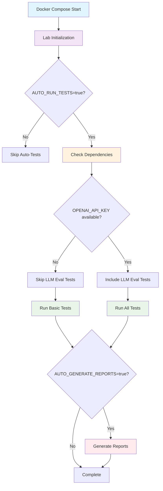

# 🤖 Automation Guide - Semantic Evaluation Lab

**Complete Guide to Automated Testing, Monitoring, and Lab Management**

The Semantic Evaluation Lab now supports comprehensive automation through environment variables and Docker Compose orchestration. This guide explains how to configure and use all automation features.

## 🎯 **Quick Start Automation**

### **1. Minimal Setup (Default)**
```bash
# Copy configuration template
cp env.example .env

# Start lab with basic automation
make lab-start

# Access points:
# - Application: http://localhost:8000
# - Grafana: http://localhost:3000
# - Prometheus: http://localhost:9090
```

### **2. Full Automation Setup**
```bash
# Generate full evaluation configuration
make config-example-full-eval
mv .env.fulleval .env

# Add your OpenAI API key to .env
echo "OPENAI_API_KEY=your-openai-key-here" >> .env

# Start complete lab with all automation
make lab-start-full
```

### **3. Quick Testing Configuration**
```bash
# Generate quick start config
make config-example-quick-start
mv .env.quickstart .env

# Start testing-optimized lab
make lab-start-testing
```

## 🔧 **Environment Variable Categories**

### **Core AI Configuration**
Controls the primary AI service and model settings:

```bash
# AI Service Selection
USE_OLLAMA=true                           # Use Ollama (true) or Azure OpenAI (false)
OLLAMA_HOST=http://localhost:11434        # Ollama service endpoint
OLLAMA_MODEL_ID=qwen2.5:latest           # Primary model for conversations

# Azure OpenAI (when USE_OLLAMA=false)
AZURE_OPENAI_API_KEY=your-key-here
AZURE_OPENAI_ENDPOINT=https://your-resource.openai.azure.com/
AZURE_OPENAI_DEPLOYMENT_NAME=gpt-35-turbo

# DeepEval LLM Evaluation
OPENAI_API_KEY=your-openai-key-here      # Required for LLM evaluation metrics
```

### **Lab Environment Configuration**
Defines the lab identity and operational mode:

```bash
LAB_ENVIRONMENT=development              # Environment: development, staging, production
LAB_NAME=Semantic-Evaluation-Lab        # Lab identification name
LAB_VERSION=1.0.0                       # Version tracking
LAB_ADMIN_EMAIL=admin@lab.local         # Administrator contact
ENABLE_DEBUG_MODE=true                  # Debug logging and verbose output
```

### **Auto-Trigger Configuration**
Controls automated behavior when Docker services start:

```bash
# Master Automation Switch
AUTO_RUN_TESTS=false                    # Enable all test automation

# Individual Test Suite Automation
AUTO_RUN_UNIT_TESTS=true               # Auto-run unit tests
AUTO_RUN_FUNCTIONAL_TESTS=false        # Auto-run functional tests
AUTO_RUN_LLM_EVAL_TESTS=false         # Auto-run LLM evaluation tests
AUTO_RUN_CONVERSATION_TESTS=false      # Auto-run conversation chain tests
AUTO_RUN_LOAD_TESTS=false             # Auto-run load tests

# Setup Automation
AUTO_SETUP_MODELS=true                 # Auto-download Ollama models
AUTO_GENERATE_REPORTS=true             # Auto-generate test reports
```

### **Test Configuration**
Fine-tune test execution behavior:

```bash
TEST_TIMEOUT_SECONDS=1800              # Maximum test execution time
TEST_RETRY_COUNT=3                     # Number of retries for failed tests
TEST_PARALLEL_WORKERS=2                # Parallel test execution workers

# Conversation Chain Testing
CONVERSATION_CHAIN_LENGTHS=5,10,15     # Chain lengths to test
ENABLE_CONVERSATION_STABILITY_TESTS=true
ENABLE_DYNAMIC_CONVERSATION_TESTS=true
```

### **Load Testing Configuration**
Configure automated load testing behavior:

```bash
LOCUST_USERS=1                         # Number of simulated users
LOCUST_SPAWN_RATE=1                    # Users spawned per second
LOCUST_RUN_TIME=300s                   # Load test duration

LOAD_TEST_TARGET_HOST=http://localhost:8000  # Target for load tests
ENABLE_LOAD_TEST_AUTO_SCALING=false    # Auto-scale based on performance
LOAD_TEST_QUALITY_THRESHOLD=0.7        # Minimum quality score under load
```

### **Monitoring & Observability**
Control monitoring stack automation:

```bash
ENABLE_MONITORING=true                 # Start Prometheus/Grafana automatically
PROMETHEUS_RETENTION_TIME=7d           # Metrics retention period
PROMETHEUS_RETENTION_SIZE=1GB          # Maximum storage for metrics

# Service Ports
PROMETHEUS_PORT=8000                   # Metrics exporter port
GRAFANA_PORT=3000                     # Grafana dashboard port
NODE_EXPORTER_PORT=9100               # System metrics port

# Monitoring Features
ENABLE_ALERTING=true                   # Enable Grafana alerting
METRICS_COLLECTION_INTERVAL=15s        # Metrics collection frequency
ENABLE_OLLAMA_METRICS=true            # Monitor Ollama performance
```

## 🚀 **Automation Scenarios**

### **Scenario 1: Continuous Integration**
Perfect for CI/CD pipelines with automated testing:

```bash
# .env configuration
LAB_ENVIRONMENT=ci
CI_MODE=true
AUTO_RUN_TESTS=true
AUTO_RUN_UNIT_TESTS=true
AUTO_RUN_FUNCTIONAL_TESTS=true
AUTO_RUN_LLM_EVAL_TESTS=true
AUTO_GENERATE_REPORTS=true
ENABLE_MONITORING=false  # Disable monitoring in CI
```

```bash
# Start CI pipeline
make lab-start-testing
```

### **Scenario 2: Development with Live Monitoring**
Ideal for active development with real-time monitoring:

```bash
# .env configuration
LAB_ENVIRONMENT=development
AUTO_RUN_TESTS=false          # Manual test control
AUTO_SETUP_MODELS=true        # Auto-setup models
ENABLE_MONITORING=true        # Live monitoring
ENABLE_DEBUG_MODE=true        # Verbose logging
```

```bash
# Start development environment
make lab-start

# Run tests manually when needed
make auto-test-unit
make auto-test-functional
```

### **Scenario 3: Load Testing Laboratory**
Focused on performance and load testing:

```bash
# .env configuration
LAB_ENVIRONMENT=load-testing
AUTO_RUN_LOAD_TESTS=true
LOCUST_USERS=5
LOCUST_SPAWN_RATE=1
LOCUST_RUN_TIME=600s
LOAD_TEST_QUALITY_THRESHOLD=0.8
ENABLE_MONITORING=true
```

```bash
# Start load testing lab
make lab-start-load-testing

# Or run specific load tests
make auto-load-test-medium
make auto-load-test-heavy
```

### **Scenario 4: Research & Evaluation**
For comprehensive LLM evaluation and research:

```bash
# .env configuration
LAB_ENVIRONMENT=research
AUTO_RUN_TESTS=true
AUTO_RUN_LLM_EVAL_TESTS=true
AUTO_RUN_CONVERSATION_TESTS=true
CONVERSATION_CHAIN_LENGTHS=5,10,15,20,25
ENABLE_CONVERSATION_STABILITY_TESTS=true
ENABLE_DYNAMIC_CONVERSATION_TESTS=true
DEEPEVAL_VERBOSE=true
ENABLE_MONITORING=true
```

```bash
# Start research environment
make lab-start-full
```

### **Scenario 5: Production Monitoring**
Production-ready configuration with monitoring:

```bash
# .env configuration
LAB_ENVIRONMENT=production
ENABLE_DEBUG_MODE=false
LOG_LEVEL=WARNING
AUTO_RUN_TESTS=false
ENABLE_MONITORING=true
ENABLE_ALERTING=true
PROMETHEUS_RETENTION_TIME=30d
ENABLE_NOTIFICATIONS=true
```

```bash
# Start production environment
docker-compose --profile prod --profile monitoring up -d
```

## 🤖 **Auto-Test Orchestrator**

The lab includes an intelligent test orchestrator that automatically runs tests based on configuration:

### **How It Works**

1. **Configuration Detection**: Reads environment variables to determine which tests to run
2. **Dependency Checking**: Validates required services (Ollama, API keys) are available  
3. **Sequential Execution**: Runs tests in logical order with proper error handling
4. **Report Generation**: Automatically generates comprehensive test reports
5. **Graceful Degradation**: Skips tests that can't run due to missing dependencies

### **Auto-Test Commands**

```bash
# Setup testing environment
make auto-test-setup

# Run tests based on environment configuration
make auto-test-run

# Run specific test suites
make auto-test-unit                    # Unit tests only
make auto-test-functional              # Functional tests only
make auto-test-llm-eval               # LLM evaluation tests only
make auto-test-conversations          # Conversation chain tests only
make auto-test-all                    # All available tests

# Generate reports
make auto-test-reports
```

### **Auto-Test Configuration Logic**



## 📊 **Automated Monitoring Setup**

### **Monitoring Stack Automation**

The lab automatically configures a complete monitoring stack:

1. **Prometheus**: Metrics collection and storage
2. **Grafana**: Dashboard visualization with pre-configured dashboards
3. **Node Exporter**: System metrics collection
4. **Custom Metrics Exporter**: Application-specific metrics
5. **Health Monitor**: Continuous service health checking

### **Auto-Monitoring Features**

```bash
# Start monitoring automatically
ENABLE_MONITORING=true make lab-start

# Health monitoring
make monitoring-health-check

# Access monitoring
# - Grafana: http://localhost:3000 (admin/admin)
# - Prometheus: http://localhost:9090
# - Metrics: http://localhost:8000/metrics
```

### **Monitoring Configuration**

```bash
# Monitoring Behavior
ENABLE_MONITORING=true                 # Auto-start monitoring stack
ENABLE_ALERTING=true                  # Enable Grafana alerting
METRICS_COLLECTION_INTERVAL=15s       # How often to collect metrics

# Retention Settings
PROMETHEUS_RETENTION_TIME=7d          # Keep metrics for 7 days
PROMETHEUS_RETENTION_SIZE=1GB         # Maximum storage size

# Access Configuration  
GRAFANA_ADMIN_PASSWORD=admin          # Grafana admin password
PROMETHEUS_PORT=8000                  # Metrics exporter port
GRAFANA_PORT=3000                    # Grafana web interface port
```

## 🔥 **Automated Load Testing**

### **Load Test Automation**

The lab can automatically run load tests on startup:

```bash
# .env configuration
AUTO_RUN_LOAD_TESTS=true
LOCUST_USERS=3
LOCUST_SPAWN_RATE=1
LOCUST_RUN_TIME=300s
```

### **Load Testing Commands**

```bash
# Automated load tests with different intensities
make auto-load-test-light             # 1 user, 2 minutes
make auto-load-test-medium            # 3 users, 5 minutes  
make auto-load-test-heavy             # 5 users, 10 minutes
make auto-load-test-conversation      # Conversation-focused testing

# Start lab optimized for load testing
make lab-start-load-testing
```

### **Load Test Quality Monitoring**

The lab integrates DeepEval metrics with load testing:

- **Quality Under Load**: Monitors LLM response quality during load tests
- **Performance Thresholds**: Automatically validates quality doesn't degrade
- **Real-time Metrics**: Live monitoring of both performance and quality
- **Automated Reports**: Comprehensive reports combining load and quality metrics

## 🏥 **Health Monitoring & Diagnostics**

### **Automated Health Checks**

```bash
# Check overall lab health
make lab-health

# Monitor specific components
make monitoring-health-check

# View live service status
make lab-status
```

### **Health Monitor Service**

The lab includes a dedicated health monitoring service that continuously checks:

- **Ollama Service**: API availability and model status
- **Prometheus**: Metrics collection health  
- **Grafana**: Dashboard availability
- **Metrics Exporter**: Custom metrics health
- **Network Connectivity**: Inter-service communication

## 📝 **Configuration Management**

### **Configuration Commands**

```bash
# Check current configuration
make config-check

# Generate configuration files
make config-generate                  # Create .env from template
make config-example-quick-start       # Quick start configuration
make config-example-full-eval        # Full evaluation configuration

# Validate configuration
make config-validate                  # Check Docker Compose validity
```

### **Environment File Management**

The lab supports multiple environment configurations:

```bash
# Default configuration
.env                                  # Primary configuration file

# Template configurations  
env.example                          # Complete template with all variables
.env.quickstart                     # Quick start configuration
.env.fulleval                       # Full evaluation configuration
.env.ci                            # CI/CD optimized configuration
.env.production                    # Production environment configuration
```

## 🎛️ **Advanced Automation Features**

### **Intelligent Service Orchestration**

The lab intelligently manages service dependencies:

1. **Startup Order**: Services start in the correct dependency order
2. **Health Waiting**: Services wait for dependencies to be healthy
3. **Graceful Degradation**: Continues operation if non-critical services fail
4. **Automatic Recovery**: Restarts failed services automatically

### **Dynamic Configuration**

Environment variables can be overridden at runtime:

```bash
# Override configuration for specific runs
AUTO_RUN_TESTS=true LOCUST_USERS=10 make lab-start

# Temporary configuration changes
ENABLE_DEBUG_MODE=true LOG_LEVEL=DEBUG make lab-restart
```

### **Resource Management**

Automatic resource allocation and limits:

```bash
# Resource Configuration
MAX_MEMORY_USAGE=1G                   # Memory limit per container
MAX_CPU_CORES=2                       # CPU core limit
ENABLE_PERFORMANCE_PROFILING=false    # Enable performance monitoring
ENABLE_MEMORY_MONITORING=true         # Monitor memory usage
```

## 🔧 **Troubleshooting Automation**

### **Common Issues & Solutions**

#### **Tests Not Auto-Running**
```bash
# Check configuration
make config-check

# Verify AUTO_RUN_TESTS is enabled
echo $AUTO_RUN_TESTS

# Check service logs
make lab-logs-tests
```

#### **Monitoring Not Starting**
```bash
# Check monitoring configuration
echo $ENABLE_MONITORING

# Verify monitoring health
make monitoring-health-check

# Check monitoring logs
make lab-logs-monitoring
```

#### **Load Tests Failing**
```bash
# Check load test configuration
echo $LOCUST_USERS $LOCUST_SPAWN_RATE $LOCUST_RUN_TIME

# Verify target availability
curl -f $LOAD_TEST_TARGET_HOST

# Check load test logs
docker-compose logs locust
```

### **Debug Mode**

Enable comprehensive debugging:

```bash
# Enable debug mode
ENABLE_DEBUG_MODE=true LOG_LEVEL=DEBUG make lab-start

# View detailed logs
make lab-logs

# Check individual service logs
make lab-logs-app
make lab-logs-tests
make lab-logs-monitoring
```

## 📚 **Example Automation Workflows**

### **Daily Development Workflow**
```bash
# Morning startup
make config-check
make lab-start

# Run tests when needed
make auto-test-unit
make auto-test-functional

# Check health throughout day
make lab-health

# Evening shutdown
make lab-stop
```

### **CI/CD Pipeline Integration**
```bash
# GitHub Actions example
name: Semantic Evaluation Lab CI
on: [push, pull_request]
jobs:
  test:
    runs-on: ubuntu-latest
    steps:
      - uses: actions/checkout@v4
      - name: Setup Lab
        run: |
          cp env.example .env
          echo "CI_MODE=true" >> .env
          echo "AUTO_RUN_TESTS=true" >> .env
          echo "OPENAI_API_KEY=${{ secrets.OPENAI_API_KEY }}" >> .env
      - name: Run Tests
        run: make lab-start-testing
      - name: Generate Reports
        run: make auto-test-reports
```

### **Research Evaluation Session**
```bash
# Setup research environment
make config-example-full-eval
mv .env.fulleval .env
echo "OPENAI_API_KEY=your-key" >> .env

# Start comprehensive evaluation
make lab-start-full

# Monitor progress
make lab-status
make monitoring-health-check

# Generate research reports
make auto-test-reports
```

## 🎯 **Best Practices**

### **Environment Configuration**
1. **Use Templates**: Start with provided configuration templates
2. **Version Control**: Store environment templates in version control
3. **Secret Management**: Keep API keys in secure environment variables
4. **Documentation**: Document custom configuration choices

### **Automation Strategy**
1. **Start Simple**: Begin with basic automation, add complexity gradually
2. **Test Incrementally**: Validate each automation layer before adding more
3. **Monitor Health**: Always enable health monitoring in automated environments
4. **Plan Resources**: Configure resource limits for stable operation

### **Development Workflow**
1. **Use Aliases**: Leverage short command aliases for frequent operations
2. **Check Status**: Regularly check lab status and health
3. **Clean Regularly**: Use cleanup commands to maintain performance
4. **Log Review**: Review logs to understand automation behavior

This automation framework transforms the Semantic Evaluation Lab into a fully automated, self-managing AI evaluation environment that can adapt to any workflow from development to production deployment. 