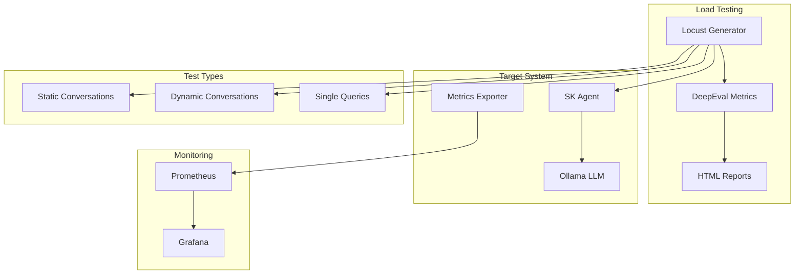

# 🔥 Load Testing Guide - Semantic Evaluation Lab

This guide provides comprehensive instructions for load testing the **Semantic Evaluation Lab** application using **Locust** with integrated **DeepEval metrics** for quality assessment under load conditions.

## 🎯 Overview

The load testing framework combines:

- **[Locust](https://locust.io/)**: Modern load testing framework with web UI
- **[DeepEval](https://github.com/confident-ai/deepeval)**: LLM evaluation metrics for quality assessment
- **Static & Dynamic Conversations**: Both conversation types from the existing test suite
- **Real-time Monitoring**: Integration with Prometheus and Grafana
- **Docker Integration**: Containerized load testing environment

## 🚀 Quick Start

### 1. Validate Setup
```bash
# Ensure load testing is properly configured
make load-test-validate
```

### 2. Start Interactive Load Testing
```bash
# Start Locust web UI for interactive testing
make load-test-start

# Access: http://localhost:8089
# Configure users, spawn rate, and duration in web interface
```

### 3. Run Automated Load Tests
```bash
# Quick automated tests
make load-test-light        # 1 user, 2 minutes
make load-test-medium       # 3 users, 5 minutes
make load-test-heavy        # 5 users, 10 minutes
```

### 4. Load Testing with Monitoring
```bash
# Start complete monitoring + load testing stack
make load-test-with-monitoring

# Access points:
# - Locust: http://localhost:8089
# - Grafana: http://localhost:3000
# - Prometheus: http://localhost:9090
```

## 🔧 Load Test Configurations

| Command | Users | Spawn Rate | Duration | Purpose |
|---------|-------|------------|----------|---------|
| `make load-test-light` | 1 | 1/sec | 2 min | Quick validation |
| `make load-test-medium` | 3 | 1/sec | 5 min | Standard load test |
| `make load-test-heavy` | 5 | 1/sec | 10 min | Performance testing |
| `make load-test-stress` | 10 | 2/sec | 15 min | Stress testing |
| `make load-test-conversations` | 2 | 0.5/sec | 10 min | Conversation-focused |

## 🏗️ Architecture



## 📊 DeepEval Metrics Under Load

The load testing framework evaluates quality using DeepEval metrics:

### Core Metrics
- **Answer Relevancy**: Response relevance to user questions (threshold: 0.7)
- **Response Quality Under Load**: Coherence despite system load (threshold: 0.75)
- **Load Resilience**: Quality consistency under stress (threshold: 0.8)

### Custom G-Eval Metrics
```python
# Response Quality Under Load
criteria = """
Evaluate the response quality considering load testing context:
1. Response coherence and clarity despite potential system load
2. Accuracy and relevance to the user's question
3. Consistency with expected behavior under normal conditions
4. Absence of errors or degraded responses due to load
"""

# Load Resilience Metric
criteria = """
Assess how well the system maintains quality under load:
1. Response maintains expected quality standards
2. No significant degradation in response intelligence
3. Consistent response structure and formatting
4. Appropriate handling of complex queries under load
"""
```

## 🧪 Test Types

### 1. Static Conversation Chains
**Pre-orchestrated conversation flows**
- Mathematical content (Linear Algebra, Calculus, Probability)
- Predictable question patterns
- Framework stability testing
- Baseline performance metrics

### 2. Dynamic Conversation Chains ⭐ **NEW!**
**Question-from-response generation**
- Natural conversation evolution
- Real-world conversation patterns
- Adaptive load testing
- Emergent complexity testing

### 3. Single Query Tests
**Individual question/response pairs**
- High-frequency testing
- Quick response validation
- Baseline performance metrics
- Semantic Kernel knowledge testing

## 📋 Load Testing Commands

### Core Commands
```bash
# Interactive load testing
make load-test-start          # Start web UI
make load-test-stop           # Stop all services
make load-test-logs           # View logs
make load-test-status         # Check service status

# Automated load testing
make load-test-headless       # Default (1 user, 5 min)
make load-test-light          # Light load (1 user, 2 min)
make load-test-medium         # Medium load (3 users, 5 min)
make load-test-heavy          # Heavy load (5 users, 10 min)
make load-test-stress         # Stress test (10 users, 15 min)
```

### Specialized Tests
```bash
# Conversation-focused tests
make load-test-conversations           # Mixed conversations
make load-test-static-conversations    # Static chains only
make load-test-dynamic-conversations   # Dynamic chains only
make load-test-mixed-workload         # Balanced workload

# With monitoring
make load-test-with-monitoring        # Full monitoring stack
```

### Analysis and Reporting
```bash
# Generate reports
make load-test-reports                # All reports
make load-test-deepeval-analysis      # DeepEval analysis

# Maintenance
make load-test-cleanup               # Clean test data
make load-test-health                # Health check
make load-test-validate              # Validate setup
```

### Quick Aliases
```bash
make lt-start                        # Start load test
make lt-medium                       # Medium load test
make lt-health                       # Health check
make lt-stop                         # Stop load test
```

## 🔧 Configuration

### Environment Variables
```bash
# Load test parameters
export LOCUST_USERS=5                # Number of concurrent users
export LOCUST_SPAWN_RATE=1           # Users spawned per second  
export LOCUST_RUN_TIME=300s          # Test duration

# Service configuration
export USE_OLLAMA=true               # Use Ollama for testing
export OLLAMA_HOST=http://ollama:11434  # Ollama service URL
export OPENAI_API_KEY=your_key_here  # For DeepEval metrics
```

### Custom Load Test
```bash
# Run custom configuration
LOCUST_USERS=7 LOCUST_SPAWN_RATE=2 LOCUST_RUN_TIME=420s make load-test-headless
```

## 📈 Reports and Analytics

### Locust Reports
- **HTML Report**: `test-reports/locust_report.html`
- **CSV Statistics**: `test-reports/locust_stats_*.csv`
- **Real-time Metrics**: Response times, throughput, failures

### DeepEval Analytics
- **JSON Report**: `load_test_deepeval_report.json`
- **Quality Metrics**: Answer relevancy, response quality, load resilience
- **Aggregated Statistics**: Mean, min, max, success rates

### Sample Report Output
```bash
make load-test-reports

# Output:
📊 Generating load test reports...
📋 Locust HTML Report: test-reports/locust_report.html
📋 DeepEval Metrics Report: load_test_deepeval_report.json
Summary:
  Total Requests: 45
  Success Rate: 95.56%
  Avg Response Time: 2,341.22ms
📁 All reports available in: test-reports/
```

### DeepEval Analysis Example
```bash
make load-test-deepeval-analysis

# Output:
=== DEEPEVAL LOAD TEST ANALYSIS ===
Load Test Summary:
  Total Requests: 45
  Total Failures: 2
  Avg Response Time: 2,341.22ms
  Requests/Second: 2.15

DeepEval Quality Metrics:
  Success Rate: 95.56%
  Error Rate: 4.44%
  answer_relevancy: 0.834 (±0.156)
  response_quality: 0.789 (±0.203)
  load_resilience: 0.812 (±0.178)

Detailed report: load_test_deepeval_report.json
```

## 🔄 Integration with Existing Tests

The load testing framework reuses existing conversation test logic:

### Static Conversations
```python
# Reuses ConversationChainGenerator from test_conversation_chains.py
from tests.llm_evaluation.test_conversation_chains import ConversationChainGenerator

static_generator = ConversationChainGenerator()
conversation = static_generator.generate_conversation_chain(chain_length)
```

### Dynamic Conversations
```python
# Reuses DynamicConversationGenerator from test_dynamic_conversation_chains.py
from tests.llm_evaluation.test_dynamic_conversation_chains import DynamicConversationGenerator

dynamic_generator = DynamicConversationGenerator()
conversation = await dynamic_generator.generate_dynamic_conversation_chain(chain_length, agent)
```

### DeepEval Metrics
```python
# Reuses existing DeepEval setup from llm_evaluation tests
from deepeval.metrics import AnswerRelevancyMetric, GEval
from deepeval.test_case import LLMTestCase

# Custom load testing metrics
response_quality = GEval(
    name="ResponseQualityUnderLoad",
    criteria="Evaluate response quality under load conditions...",
    threshold=0.75
)
```

## 🚨 Troubleshooting

### Common Issues

#### 1. Services Not Ready
```bash
# Check all service health
make load-test-health

# Setup services first
make load-test-setup
make monitoring-setup
```

#### 2. High Failure Rates
```bash
# Check logs
make load-test-logs

# Reduce load
LOCUST_USERS=1 make load-test-headless

# Check Ollama service
curl http://localhost:11434/api/tags
```

#### 3. Quality Degradation
```bash
# Analyze DeepEval metrics
make load-test-deepeval-analysis

# Compare with baseline tests
make test-conversation-chains
```

#### 4. Docker Issues
```bash
# Validate configuration
make load-test-validate
make docker-validate

# Clean and restart
make load-test-cleanup
docker system prune -f
```

### Performance Troubleshooting

#### Response Time Issues
```bash
# Check system resources
make monitoring-health
docker stats

# Reduce concurrent users
LOCUST_USERS=1 LOCUST_SPAWN_RATE=0.5 make load-test-headless
```

#### Memory Issues
```bash
# Monitor memory usage
make monitoring-start
# Check Grafana memory dashboard

# Restart services
make load-test-stop
make monitoring-restart
make load-test-start
```

## 📊 Performance Expectations

### Baseline Performance
| Metric | Light Load | Medium Load | Heavy Load | Stress Test |
|--------|------------|-------------|------------|-------------|
| **Users** | 1 | 3 | 5 | 10 |
| **Response Time** | <2s | <3s | <5s | <8s |
| **Success Rate** | >99% | >95% | >90% | >85% |
| **DeepEval Quality** | >0.8 | >0.75 | >0.7 | >0.65 |

### Quality Thresholds
- **Answer Relevancy**: >0.7 (maintains relevance under load)
- **Response Quality**: >0.75 (coherence despite system load)
- **Load Resilience**: >0.8 (quality consistency under stress)

## 🔮 Advanced Usage

### Custom User Patterns
```python
# Create custom user classes in locustfile.py
class CustomLoadUser(ConversationLoadTestMixin, User):
    wait_time = between(2, 5)
    tasks = [CustomTaskSet]
    weight = 1
```

### Custom Metrics
```python
# Add custom DeepEval metrics
custom_metric = GEval(
    name="CustomLoadMetric",
    criteria="Your custom evaluation criteria...",
    threshold=0.8
)
```

### Integration with CI/CD
```bash
# Run load tests in CI pipeline
make load-test-headless
make load-test-reports

# Export metrics for analysis
make monitoring-export-metrics
```

## 🤝 Contributing

To add new load testing features:

1. **Add new test types** in `tests/load_testing/locustfile.py`
2. **Create custom metrics** in `tests/load_testing/deepeval_locust_tasks.py`
3. **Update Docker configuration** in `docker-compose.yml`
4. **Add new commands** to `Makefile`
5. **Document changes** in this guide

---

## 📚 References

- [Locust Documentation](https://docs.locust.io/)
- [DeepEval Documentation](https://docs.confident-ai.com/)
- [Semantic Kernel Documentation](https://learn.microsoft.com/semantic-kernel/)
- [Project README](../README.md)
- [Monitoring Setup Guide](MONITORING_SETUP.md)
- [Docker Usage Guide](DOCKER_USAGE.md) 